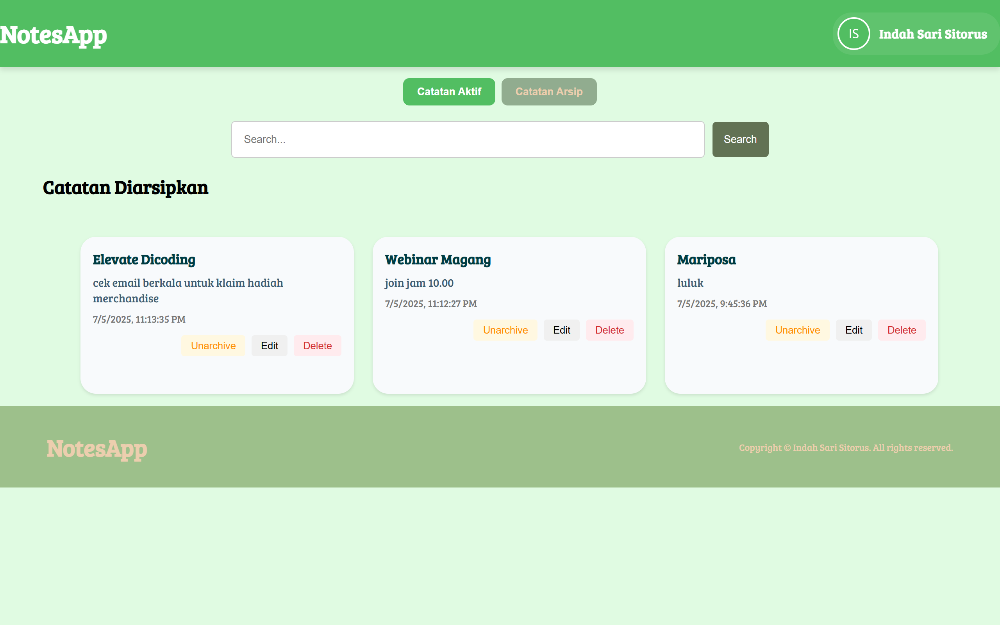
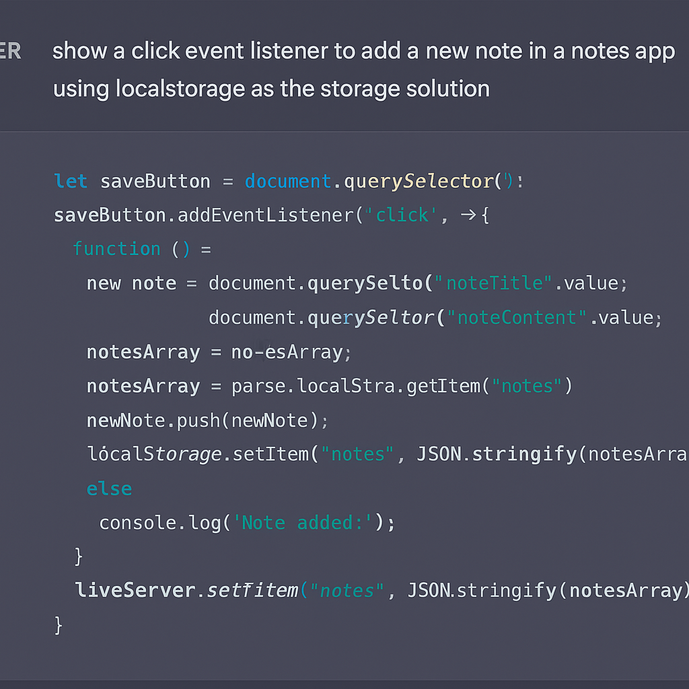

# 📝 Notes App

A simple and modern web-based note-taking application built as part of the **IBM x Hacktiv8 Capstone Project**. This app enables users to create, view, archive, unarchive, and delete notes, helping them manage personal or professional thoughts effectively.

---

## 📌 Description

🌐 [Live Demo](https://capstone-notes-app.netlify.app/)

**Notes App** is a single-page application (SPA) built using **Web Components**, styled with **CSS**, and utilizes **localStorage** to store and manage notes directly in the browser for a fast and offline-ready experience. This project demonstrates the application of modern frontend technologies and is supported by **AI assistance (IBM Granite)** during its development.

---
## ⚙️ Technologies Used

| Category         | Tech Stack                                        |
|------------------|---------------------------------------------------|
| **Frontend**     | HTML, CSS, JavaScript (ES6), Web Components       |
| **Styling**      | Tailwind CSS                                      |
| **Module Bundler** | Webpack                                         |
| **Storage**      | `localStorage` (browser-based persistent storage) |
| **AI Support**   | IBM Granite (AI-assisted coding and documentation)|
| **Version Control** | Git & GitHub                                   |
| **Deployment**   | Netlify (live demo), GitHub Pages (alternative)   |

---

## ✨ Features

- ➕ **Create Notes**: Add notes with title and content
- 🗃️ **Archive & Unarchive**: Easily move notes between active and archived sections
- 🔍 **Search**: Search notes by title or keywords
- ✏️ **Edit**: Update existing note content
- ❌ **Delete**: Remove notes permanently
- 📦 **Local Storage**: Uses `localStorage` to retain notes even after page reloads
- 🧠 **AI-Assisted Development**: IBM Granite used for speeding up code writing and documentation
- 📱 **Responsive Design**: Optimized for desktop and mobile views
- ⚡ **Fast Performance**: Built with Webpack for optimized delivery

---

## 🤖 AI Support Explanation

While the application itself does not include end-user AI features, **IBM Granite** was used during development to:

- Generate boilerplate code snippets and structure for Web Components
- Assist in logic planning for note management (CRUD + archive separation)
- Improve documentation (README, comments, user flow)
- Provide suggestions for responsive UI adjustments using Tailwind CSS

> IBM Granite effectively accelerated the development workflow by acting as a smart assistant during planning, coding, and documentation.

---

## 🔄 User Flow Diagram

```
┌────────────────────────────┐
│     Input Note Form        │
│  (Title + Content fields)  │
└────────────┬───────────────┘
             │
             ▼
     Click "Save" Button
             │
             ▼
 ┌──────────────────────────┐
 │ Note added to localStorage │
 └────────────┬─────────────┘
              │
              ▼
 ┌──────────────────────────────┐
 │  Shown in "Active Notes" list│
 └──────┬──────────────┬────────┘
        ▼              ▼
   [Archive]         [Delete]
        │              │
        ▼              ▼
Move to Archive   Remove from localStorage
```

---

## 🚀 Setup Instructions

Ikuti langkah-langkah berikut untuk menjalankan proyek ini secara lokal di komputermu:

### 1. Clone Repository

```bash
https://github.com/indahsaa/notes-app.git
cd notes-app
```

### 2. Install Dependencies

```bash
npm install
```

### 3. Run Development Server

```bash
npm run start-dev
```

### 4. Build for Production

```bash
npm run build
```

---

## 📸 Screenshots

### 📝 Halaman Catatan Aktif


### 🗃️ Halaman Catatan Diarsipkan


### 🤖 Bukti Dukungan AI Granite

